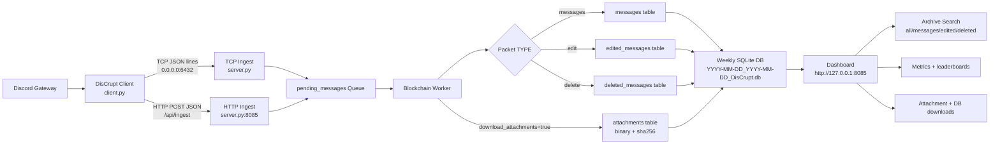
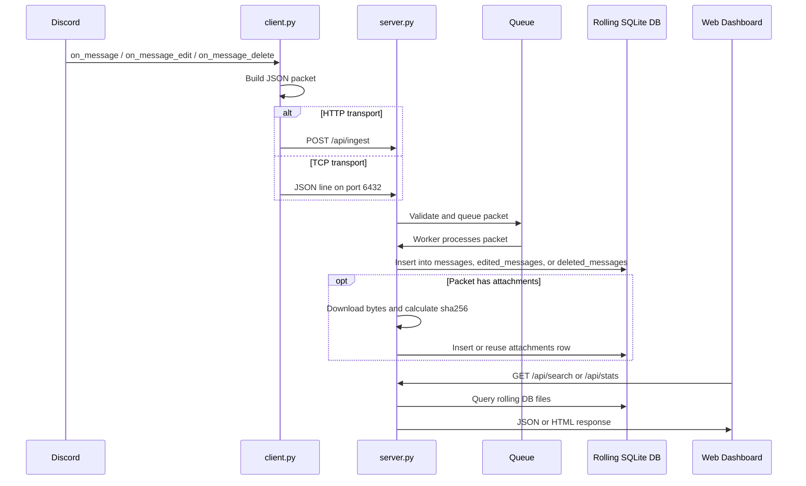
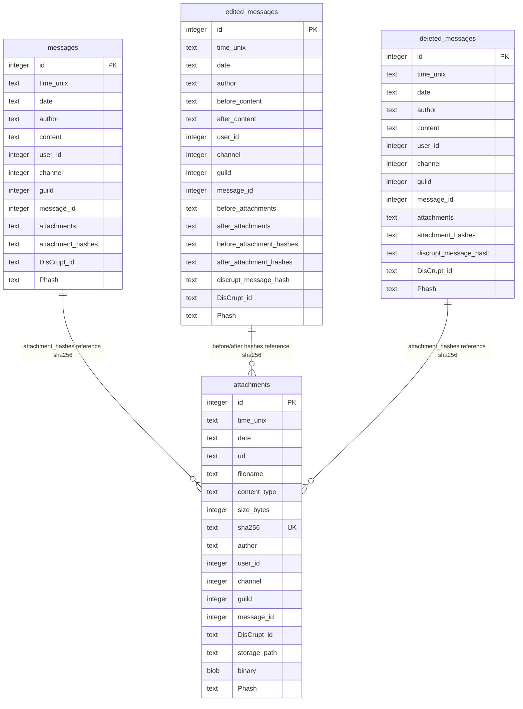

# DisCrupt Project Guide

DisCrupt is a local Discord archive system. A Discord client captures message events, sends them to a DisCrupt server over TCP or HTTP, and the server stores them in rolling SQLite database files with chained hashes. The local web dashboard on port `8085` lets you search messages, review metrics, browse saved attachments, and download raw database files.

This document describes the current project shape, how data moves through the system, and how to run and operate it.

## Current Snapshot

The local archive currently contains these rows across the rolling database files in `data/`.


| Table              |    Rows |
| ------------------ | ------: |
| `messages`         | 206,928 |
| `edited_messages`  |  11,769 |
| `deleted_messages` |   9,064 |
| `attachments`      |       0 |


| Database file                       | Messages |  Edits | Deletes | Attachments |
| ----------------------------------- | -------: | -----: | ------: | ----------: |
| `2023-03-20_2023-03-26_DisCrupt.db` |   16,644 |    364 |     984 |           0 |
| `2023-03-27_2023-04-02_DisCrupt.db` |    5,097 |    294 |     343 |           0 |
| `2025-01-06_2025-01-12_DisCrupt.db` |      722 |     34 |      28 |           0 |
| `2025-01-13_2025-01-19_DisCrupt.db` |  184,465 | 11,077 |   7,709 |           0 |

## Repository Map


| Path                            | Purpose                                                                                                          |
| ------------------------------- | ---------------------------------------------------------------------------------------------------------------- |
| `server.py`                     | TCP ingest server, HTTP dashboard, HTTP ingest API, SQLite storage, attachment chain, search, metrics, downloads |
| `client.py`                     | Discord client that captures message, edit, and delete events and forwards packets to the server                 |
| `cfg.py`                        | TCP bind host/port and storage path defaults                                                                     |
| `clean_pending.py`              | Imports, deduplicates, and cleans legacy`pending.txt` packet backups                                             |
| `server_config.json`            | Dashboard, logging, HTTP ingest, and attachment settings                                                         |
| `config.example.json`           | Example client configuration                                                                                     |
| `site_assets/discrupt-logo.png` | Dashboard logo                                                                                                   |
| `data/`                         | Rolling SQLite DB files, logs, pending packet files, server stdout/stderr logs                                   |

## Architecture Visualization



## Event Sequence



## Database Model

Each weekly DB has the same core chain tables. Older 2023 DB files may not have newer attachment hash columns, so the server checks columns dynamically before querying.



## Chain Design

DisCrupt keeps a lightweight chain inside each table.


| Field                   | Meaning                                                            |
| ----------------------- | ------------------------------------------------------------------ |
| `Phash`                 | Hash of the previous row in the same table                         |
| `discrupt_message_hash` | For edits/deletes, hash of the original message row when available |
| `sha256`                | Attachment content hash                                            |
| `attachment_hashes`     | JSON list of attachment`sha256` values referenced by a message row |

The chain is table-local. A `messages` row links to the previous `messages` row, an `edited_messages` row links to the previous `edited_messages` row, and so on. Attachments have their own chain in the same rolling DB file.

## Server

Run the server from the project directory:

```powershell
python server.py
```

Default listeners:


| Service     | Default                            |
| ----------- | ---------------------------------- |
| TCP ingest  | `0.0.0.0:6432`                     |
| Dashboard   | `http://127.0.0.1:8085/`           |
| HTTP ingest | `http://127.0.0.1:8085/api/ingest` |

The web port is configured in `server_config.json`:

```json
{
  "web_enabled": true,
  "web_host": "127.0.0.1",
  "web_port": 8085
}
```

## Client

The client reads `config.json` and forwards Discord events to the server.

Recommended supported account type:

```json
{
  "account_type": "bot"
}
```

Transport choices:

```json
{
  "transport": "tcp",
  "server_host": "127.0.0.1",
  "server_port": 6432
}
```

```json
{
  "transport": "http",
  "server_url": "https://your-tunnel.example.com/api/ingest"
}
```

Run the client:

```powershell
python client.py
```

## HTTP Ingest

The HTTP ingest endpoint exists so Cloudflare Tunnel or another HTTPS reverse proxy can expose DisCrupt without requiring raw TCP access.

Endpoint:

```text
POST /api/ingest
```

Accepted packet shapes:

```json
{
  "TYPE": "messages",
  "date": "2026-07-10 12:00:00",
  "time_unix": "1783702800",
  "content": "message text",
  "author": "user#0000",
  "channel": 123,
  "guild": 456,
  "message_id": 789,
  "attachments": [],
  "DisCrupt_id": "collector-id",
  "user_id": 111
}
```

```json
{
  "TYPE": "edit",
  "before_content": "old text",
  "after_content": "new text",
  "message_id": 789
}
```

```json
{
  "TYPE": "delete",
  "content": "deleted text",
  "message_id": 789
}
```

Optional security:


| Config key            | Purpose                                                   |
| --------------------- | --------------------------------------------------------- |
| `http_ingest_enabled` | Turns`/api/ingest` on or off                              |
| `ingest_token`        | Requires`Authorization: Bearer ...` or `X-DisCrupt-Token` |
| `max_http_body_bytes` | Rejects large request bodies                              |

## Dashboard

The dashboard is served by `server.py` at `http://127.0.0.1:8085/`.

Current dashboard areas:


| Area                   | Purpose                                                                |
| ---------------------- | ---------------------------------------------------------------------- |
| Metrics cards          | Top capture ID, saved attachments, message counts, text bytes, DB size |
| Connection Links       | Shows TCP and HTTP ingest addresses                                    |
| Capture Leaderboard    | DisCrupt ID leaderboard, excluding anonymous/private IDs               |
| Anonymous Capture Pool | Pooled count for anonymous/unknown captures                            |
| Message Leaderboard    | Author message counts                                                  |
| Archive Search         | Search all/messages/edited/deleted with filters and row limits         |
| Saved Attachments      | Downloads from the`attachments.binary` table by `sha256`               |
| Recent Messages        | Scrollable recent message list                                         |
| Edited Messages        | Recent edited-message chain rows                                       |
| Deleted Messages       | Recent deleted-message chain rows                                      |
| Database Files         | Raw`.db` downloads                                                     |

## Dashboard APIs


| Endpoint                        | Method | Purpose                                                   |
| ------------------------------- | ------ | --------------------------------------------------------- |
| `/`                             | GET    | HTML dashboard                                            |
| `/api/stats`                    | GET    | Metrics, leaderboards, attachment file list, DB inventory |
| `/api/messages`                 | GET    | Message-only search                                       |
| `/api/search`                   | GET    | Archive search across all/messages/edits/deletes          |
| `/api/edits`                    | GET    | Edited-message search                                     |
| `/api/deletes`                  | GET    | Deleted-message search                                    |
| `/api/ingest`                   | GET    | Ingest status                                             |
| `/api/ingest`                   | POST   | Queue incoming packets                                    |
| `/download/attachment/{sha256}` | GET    | Download attachment bytes from the attachments table      |
| `/download/database/{filename}` | GET    | Download a rolling DB file                                |

Common search filters:


| Query param       | Meaning                                                    |
| ----------------- | ---------------------------------------------------------- |
| `scope`           | `all`, `messages`, `edits`, or `deletes` for `/api/search` |
| `q`               | Content text search                                        |
| `author`          | Author search                                              |
| `discrupt_id`     | Collector ID search                                        |
| `channel`         | Exact channel ID                                           |
| `guild`           | Exact guild ID                                             |
| `message_id`      | Exact message ID                                           |
| `has_attachments` | `yes`, `no`, or blank                                      |
| `limit`           | `250`, `500`, `1000`, or `all`                             |

## Attachment Storage

Attachments are designed to be stored once in the rolling DB file:

1. Server receives a message/edit/delete packet with attachment metadata.
2. Server downloads the attachment bytes if `download_attachments` is true.
3. Server calculates `sha256`.
4. If that URL or hash already exists in `attachments`, the existing chain row is reused.
5. Message/edit/delete rows store the attachment hash references.
6. Dashboard downloads stream from `attachments.binary`.

This avoids keeping a second image/file copy on disk after the binary is in the chain.

Relevant config:

```json
{
  "download_attachments": true,
  "attachment_timeout_seconds": 30,
  "max_attachment_bytes": 52428800
}
```

## Cloudflare Tunnel Shape

For normal Cloudflare Tunnel use, expose the HTTP dashboard service:

```text
http://127.0.0.1:8085
```

Then configure clients with:

```json
{
  "transport": "http",
  "server_url": "https://your-public-hostname.example/api/ingest"
}
```

Raw TCP is still available locally on port `6432`, but HTTP ingest is simpler for tunnel-based clients because they only need an HTTPS URL.


## Operational Checklist

Before a live run:

1. Set a real bot token in `config.json` or `DISCORD_TOKEN`.
2. Set `privacy` to `private` or `public`.
3. Set a stable `DisCrupt_id`.
4. Choose `transport` as `tcp` for local/LAN or `http` for tunnel use.
5. If exposing `/api/ingest`, set `ingest_token` in `server_config.json`.
6. Start `server.py`.
7. Open `http://127.0.0.1:8085/`.
8. Start `client.py`.

Health checks:

```powershell
Get-NetTCPConnection -State Listen | Where-Object { @(8085,6432) -contains $_.LocalPort }
```

```powershell
python -m py_compile server.py client.py 
```

## Security And Privacy Notes

- Keep `config.json` private because it may contain a Discord token or ingest token.
- Prefer `DISCORD_TOKEN` and `DISCRUPT_SERVER_TOKEN` environment variables for secrets.
- Use `ingest_token` before exposing `/api/ingest` publicly.
- Anonymous/private captures are pooled and kept off the public capture leaderboard.
- Do not publish raw DB files if they contain private Discord message data.
- Use the official Discord bot account flow for supported operation.

## Troubleshooting


| Symptom                           | Likely cause                                               | Fix                                                          |
| --------------------------------- | ---------------------------------------------------------- | ------------------------------------------------------------ |
| Dashboard does not load           | Server is not running or wrong port                        | Start`server.py`, check `server_config.json` port            |
| Client says HTTP ingest failed    | Bad`server_url`, tunnel offline, token mismatch            | Check`/api/ingest`, URL, and ingest token                    |
| Client says TCP connection failed | Server not listening on`6432` or firewall issue            | Start server, check bind host and firewall                   |
| Search feels slow                 | `limit=all` on large DB set                                | Use`250`, `500`, or narrower filters                         |
| Attachments do not download       | No binary in`attachments` table or attachment fetch failed | Check`download_attachments`, server logs, and attachment row |
| CommandNotFound noise             | Bot command prefix matched a normal message                | Disable command processing if commands are not used          |

## Future Improvements

Good next steps:

- Add a first-class `requirements.txt` for the project root.
- Add indexes on common search columns for large archives.
- Add dashboard pagination for `limit=all`.
- Add integrity-check tooling for `Phash` chains.
- Add an ingest-token setup prompt.
- Add export tools for selected messages, edits, deletes, and attachments.
